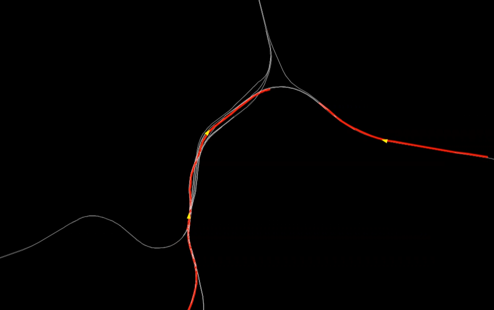

# The MATSim Switzerland Railway Scenario

----

### About this project

This repository provides a MATSim model for Switzerland's railway developed by Swiss Federal Railways (Schweizerische Bundesbahnen, SBB), Corporate Development.

Developers/Contributors: Merlin Unterfinger, Thomas Hettinger, Ihab Kaddoura

### Licenses

The **MATSim program code** in this repository is distributed under the terms of the [GNU Affero General Public License v3.0](https://www.gnu.org/licenses/agpl-3.0.html.en). The MATSim program code are files that reside in the `src` directory hierarchy and typically end with `*.java`.

The **MATSim input files, output files, analysis data and visualizations** are licensed under a <a rel="license" href="http://creativecommons.org/licenses/by/4.0/">Creative Commons Attribution 4.0 International License</a>.
  MATSim input files are those that are used as input to run MATSim. They often, but not always, have a header pointing to matsim.org. They typically reside in the `matsim_input` or `scenarios` directory hierarchy. MATSim output files, analysis data, and visualizations are files generated by MATSim runs, or by postprocessing.  They typically reside in a directory hierarchy starting with `output`.

**Other data files**, in particular in `original_data`, have their own individual licenses that need to be individually clarified with the copyright holders.

----

### Prepare the input files

##### Step 1: Get the required original data

1. Download the GTFS file, e.g., from https://opentransportdata.swiss/en/group/timetables-gtfs.
1. Download the OSM file, e.g., from https://download.geofabrik.de/europe/switzerland.html.
11. (Optional) Process the OSM data, e.g., with osmosis. Download osmosis from https://wiki.openstreetmap.org/wiki/Osmosis. Filter the OSM data, e.g. with the following command: `osmosis --rb file=switzerland-latest.osm.pbf --tf accept-ways railway=* --used-node --wx switzerland_railways.osm`
1. Put the GTFS file (`*.zip`) and (processed) OSM file (`*.osm`) file into the `original_data` directory.

##### Step 2: Read the original data and generate the MATSim input files

1. Open the JAVA class `GenerateRailsimInput` located in `src/main/java/ch/sbb/prepare`.
1. Adjust the file names and make sure the files are locally available in the `original_data` directory.
1. Adjust some further inputs, e.g. rail product names, area of interest, ...
1. Run the `GenerateRailsimInput` class. The preparation makes use of the pt2matsim repository, see here: <https://github.com/matsim-org/pt2matsim>

----

### Run the MATSim Switzerland Railway scenario

##### ... using an IDE, e.g. Eclipse, IntelliJ
(Requires either cloning or downloading the repository.)

1. Set up the project in your IDE.
1. Make sure the project is configured as maven project.
1. Run the JAVA class `src/main/java/ch/sbb/run/RunSwitzerlandRailway.java`.
1. "Open" the output directory.  You can drag files into VIA as was already done above.
1. Edit the config file or adjust the run class. Re-run MATSim.

##### ... using a runnable jar file
(Requires either cloning or downloading the repository and java)

1. Open the cmd and go to your project directory
2. Build the scenario using `mvnw package` 
3. There should be a  `<...>.jar` file directly in the main directory.
4. Run this file from the command line using `java -jar <...>.jar --help` to see all possible options.
5. Start this scenario using the default config by running `java -jar <...>.jar`
6. "Open" the output directory.  You can drag files into VIA as was already done above.
